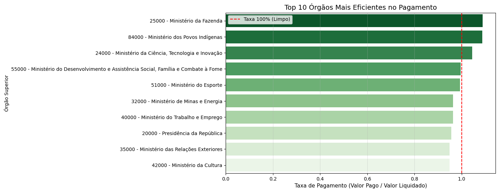
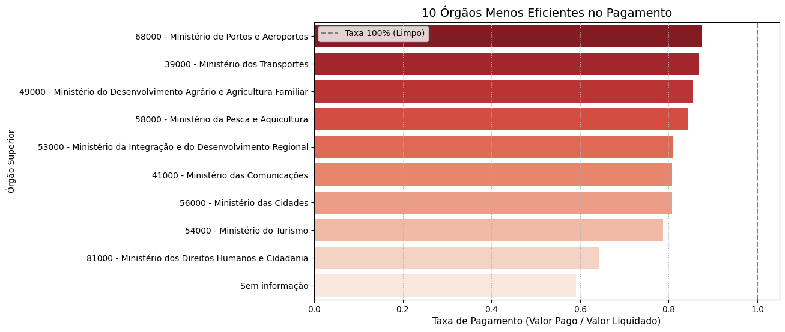
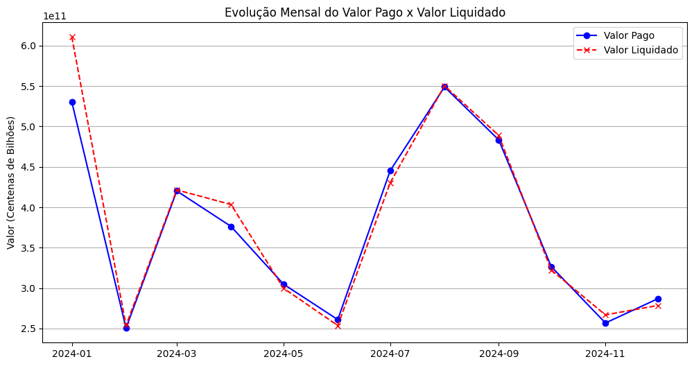

# 💰 Análise de Desempenho e Eficiência de Despesas Governamentais  
### 📊 Python • Pandas • Análise de Dados Públicos

## 🎯 Objetivo do Projeto

Este projeto foi desenvolvido com o propósito de enfrentar um **desafio real de Data Science**: trabalhar com uma base de dados pública, comum em ambientes corporativos, caracterizada por:

- Inconsistências de preenchimento  
- Formatos misturados  
- Dados sujos (outliers, valores inválidos e erros de registro)

O objetivo principal foi transformar **dados brutos de despesas governamentais** em *insights* de **desempenho orçamentário e eficiência de caixa**, ranqueando órgãos públicos com base na **velocidade e eficácia dos pagamentos**.

---

## 🧠 Aprendizados e Desafios Superados

Este projeto proporcionou um aprendizado profundo, especialmente nas etapas de **ETL** e criação de **métricas de negócio**.

### 🔹 1. Limpeza e Tratamento de Dados (ETL)

- **Valores monetários complexos:**  
  Padronização de strings no formato brasileiro (`1.000,00`) para valores numéricos (`float`) utilizando encadeamento de `.str.replace()`.

- **Tratamento de outliers e erros:**  
  Uso de `.clip(lower=0)` para neutralizar valores negativos em colunas como *Empenhado* e *Liquidado* (possíveis estornos).

- **Divisão por zero:**  
  Aplicação de `numpy.where` e `np.nan` para evitar valores infinitos (`inf`) no cálculo das taxas de eficiência.

---

### 🔹 2. Criação de KPIs Diagnósticos

O foco do projeto foi ir além do volume de gastos, criando **indicadores de eficiência financeira**:

- **Taxa de Liquidação**  
  `(Valor Liquidado / Valor Empenhado)`  
  → Mede o quanto do valor prometido foi efetivamente confirmado.

- **Taxa de Pagamento (KPI Principal)**  
  `(Valor Pago / Valor Liquidado)`  
  → Mede a eficiência do fluxo de caixa e a gestão de passivos.

> **Valor agregado:** Essas métricas permitem avaliar não apenas *quanto* se gasta, mas *quão bem* os recursos são geridos.

---

## 📊 Principais Análises e Insights

### 📌 1. Ranking de Eficiência de Pagamento

- Ranking dos órgãos com base na **Taxa de Pagamento**
- Identificação de:
  - Órgãos com taxa **> 1.0**, indicando pagamento de *Restos a Pagar*
  - Órgãos com baixa eficiência (**< 0.8**), que exigem maior atenção

📷 *Exemplo de visualização:*

  


---

### 📌 2. Análise Temporal (Sazonalidade)

- Comparação entre **Valor Pago x Valor Liquidado ao longo do tempo**
- Identificação de picos sazonais de saída de caixa

📷 *Visualização:*



---

### 📌 3. Análise Descritiva de Gastos

- Ranking dos **Top 10 órgãos com maior valor pago**
- Identificação da **concentração de despesas** entre poucos órgãos

---

## 🛠️ Tecnologias Utilizadas

- **Python** – Linguagem principal  
- **Pandas** – Limpeza, transformação e análise de dados (ETL)  
- **NumPy** – Tratamento matemático e lógica condicional  
- **Matplotlib / Seaborn** – Visualização de dados e gráficos

---

## ▶️ Como Executar o Projeto

1. Clone o repositório:
```bash
git clone https://github.com/CarlosEduardo-J/ANALISE-ORGAO
```

2. Instale as dependências:
```bash
pip install -r requirements.txt
```

3. Execute os notebooks nesta ordem:

analise_base.ipynb → Limpeza, tratamento e criação dos KPIs

analise_final.ipynb → Análises, rankings e visualizações

## 🗂️ Fonte dos Dados

Origem: Dados públicos de despesas governamentais

Formato: CSV

Arquivo: despesasPorOrgao.csv

Base pública utilizada para simular um cenário real de análise de dados governamentais, com problemas comuns encontrados no mercado.

## 📁 Estrutura do Repositório
ANALISE-ORGAO/
│
├── analise_base.ipynb
├── analise_final.ipynb
├── despesasPorOrgao.csv
├── evolucao_mensal.png
├── top10_mais_eficientes.png
├── top10_menos_eficientes.png
├── requirements.txt
└── README.md